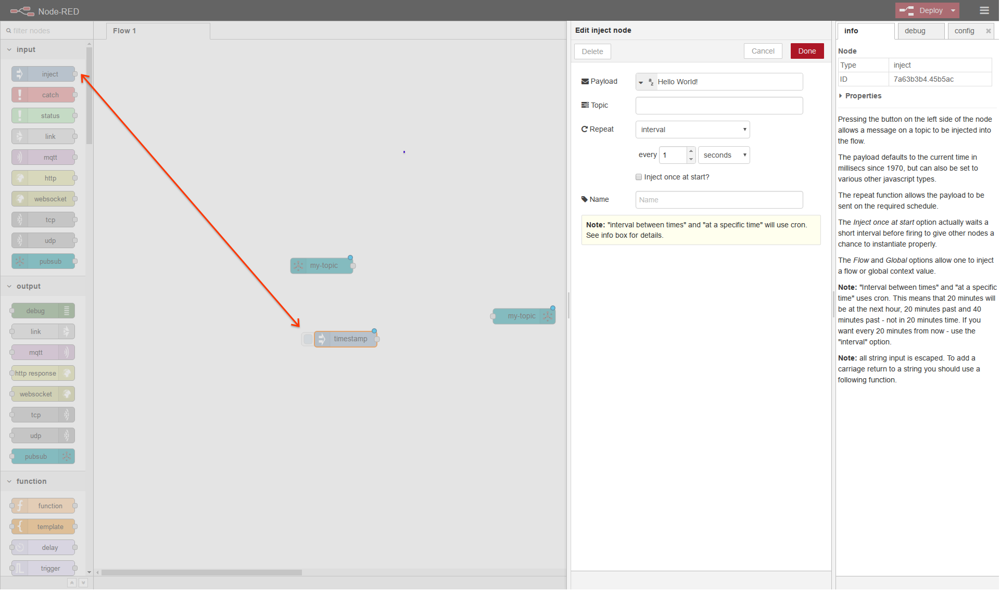
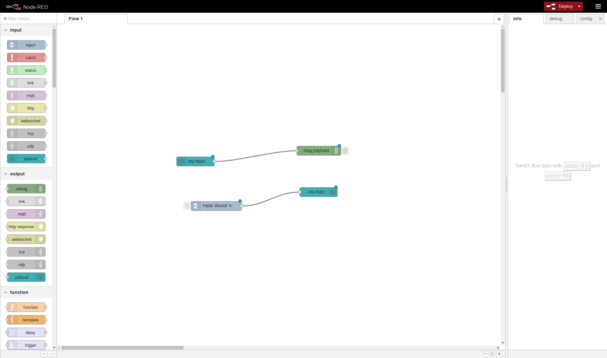
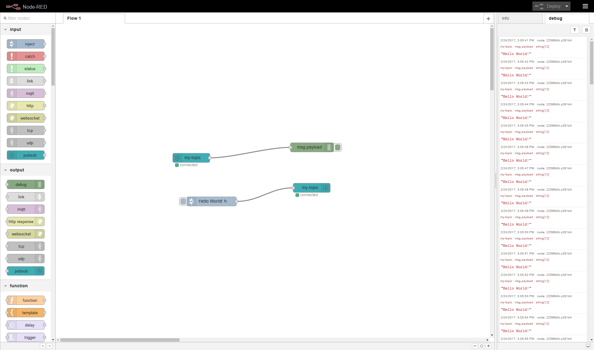

node-red-contrib-google-cloud **(ALPHA)**
=====================================

**_This is not an official Google product._**

[Node-RED](http://nodered.org) nodes for [Google Cloud Platform](https://cloud.google.com/).

## Installation

There are multiple ways to install `node-red-contrib-google-cloud`. The official ways are described in the Node-RED [documentation](https://nodered.org/docs/getting-started/adding-nodes).

## Google Cloud Credentials

| Property    | Type     | Description                                          |
| ----------- | -------- | ---------------------------------------------------- |
| **name**    | `string` | Label for easy idetification, essentially a comment. |
| **account** | `string` | Credentials in the form of a JSON key.               |

The credentials for a service account can be acquired from the [API Manager](https://console.cloud.google.com/apis/credentials). After you finish creating a service account key it will be downloaded in a JSON format.
Copy and paste the contents of the file directly into the **Key** field in the node editor.

## Google Cloud Pub/Sub

### Before You Begin

1. [Select or create a Google Cloud project.](https://console.cloud.google.com/project)
2. [Enable billing for your project.](https://support.google.com/cloud/answer/6293499#enable-billing)
3. [Enable the Pub/Sub API.](https://console.cloud.google.com/flows/enableapi?apiid=pubsub)

### Example

Create a new flow or if this is your first flow use the default one. Next drag and drop the pubsub input node onto the workspace. Then double-click the node you just placed.
Click the button with the pencil icon next to input field that says `Add new google-cloud-credentials...`. A new pane should appear with a `Name` and `Key` input field. The name can
be anything you like. The key must be the service account key. Refer to [Google Cloud Credentials](#google-cloud-credentials) on how to obtain the key. After clicking done you will
be returned to the previous pane. Fill in the `Topic` input field with an existing or new topic name and click done.

Next drag and drop the pubsub output node onto the workspace. Then double-click the node you just placed. The `Credentials` input field will be automatically filled with the credentials
you created previously. Fill in the `Topic` input field with the same name you used previously and click done.

We now have our input and output nodes, but we need some data. The easiest way to do this is using the inject input node with static data. Drag and drop the inject input node onto the workspace.
Then double-click the node you just placed. Change the `Payload` type to `string` and fill in the `Payload` input field with some text, like `Hello World!`. Lastly change the `Repeat` type to `interval`
and click done.

At this point we need some way to view the data from the pubsub input node to make sure things are working. The easiest way to accomplish this is to use the debug output node. Drag and drop the
debug output node onto the workspace. The default configuration will do with this node, but feel free to modify it.

Lastly we need to wire everything up. Connect the inject input node to the pubsub output node and the pubsub input node to the debug output node as shown below.

Click deploy. If everything goes well the pubsub nodes should change their status to `connected` and/or `publishing`. Switch to the `debug` pane on the right side to view the payload.

### Input

#### Node Properties

| Property                   | Type                       | Description                                                            |
| -------------------------- | -------------------------- | ---------------------------------------------------------------------- |
| **account**                | `google-cloud-credentials` | See [Google Cloud Credentials](#google-cloud-credentials)              |
| **topic**                  | `string`                   | Name of the topic to subscribe to.                                     |
| **subscription**           | `string`                   | Name of the subscription to create. If null one will be autogenerated. |
| **ackDeadlineSeconds**     | `integer`                  | Number of seconds to wait before attempting to redeliver a message.    |
| **encoding**               | `string`                   | Underlying encoding of the payload. Defaults to 'utf-8'.               |
| **interval**               | `integer`                  | Number of milliseconds between polling for messages.                   |
| **timeout**                | `integer`                  | Number of milliseconds before giving up on an HTTP request.            |
| **name**                   | `string`                   | Label for easy identification, essentially a comment.                  |

#### Message Properties

| Property                    | Type          | Description                                                                              |
| --------------------------- | ------------- | ---------------------------------------------------------------------------------------- |
| **payload**                 | `string`      | The payload passed as-is from the PubSub message.                                        |
| **time**                    | `date`        | The timestamp converted to the number of milliseconds since 1 January 1970 UTC.          |
| **project**                 | `string`      | The name of Google Cloud Platform project.                                               |
| **topic**                   | `string`      | The name of the topic in Google Cloud Platform.                                          |
| **subscription**            | `string`      | The name of the subscription in Google Cloud Platform.                                   |
| **resource**                | `string`      | The URI of the resource in the form of /projects/*project*/subscriptions/*subscription*. |

### Output

#### Node Properties

| Property    | Type                       | Description                                               |
| ------------| -------------------------- | --------------------------------------------------------- |
| **account** | `google-cloud-credentials` | See [Google Cloud Credentials](#google-cloud-credentials) |
| **topic**   | `string`                   | Name of the topic to publish to.                          |
| **name**    | `string`                   | Label for easy identification, essentially a comment.     |

#### Message Properties

| Property    | Type          | Description                                                                       |
| ----------- | ------------- | --------------------------------------------------------------------------------- |
| **payload** | `string`      | The payload passed as-is to the PubSub message.                                   |
| **time**    | `date`        | The timestamp converted from the number of milliseconds since 1 January 1970 UTC. |

## Troubleshooting

### After installing `node-red-contrib-google-cloud` the nodes are missing from the interface, where are they?

Refer to the Node-RED [documentation](https://nodered.org/docs/getting-started/adding-nodes) for adding nodes. If you used one of the methods described there and are still have trouble try
modifying the Node-RED [configuration](https://nodered.org/docs/configuration) with a more verbose logging level and run Node-RED from the terminal, if you are not already.
See the [running](https://nodered.org/docs/getting-started/running) Node-RED article for different ways of starting Node-RED.

### After installing `node-red-contrib-google-cloud` the logs contain errors about not finding the *grpc_node.node* module, what gives?

This issue usually comes up after installing `node-red-contrib-google-cloud` globally i.e. `sudo npm install -g node-red-contrib-google-cloud`. Some versions dislike running install scripts
as the root user and will silently fail to run the script, making the installation appear successful when in reality it failed. See [this issue](https://github.com/grpc/grpc/issues/6435) for more details.
The solution is to run the installation again, but append `--unsafe-perm` to the command i.e. `sudo npm install -g node-red-contrib-google-cloud --unsafe-perm`.
